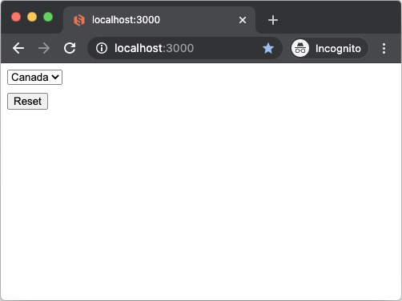
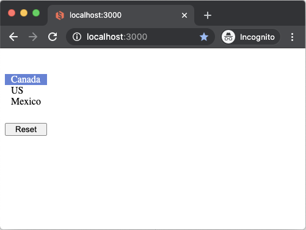
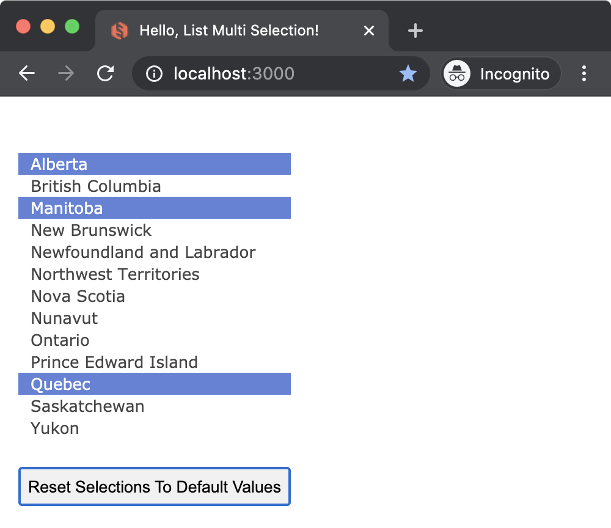
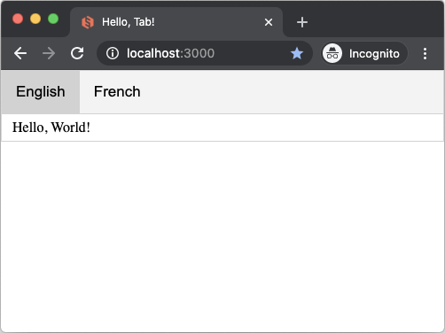
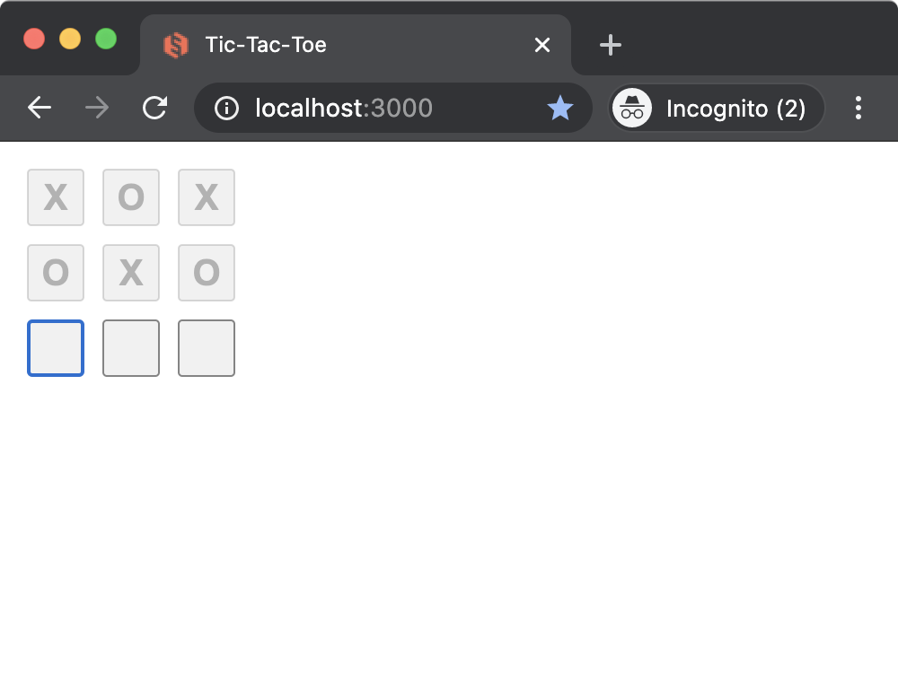
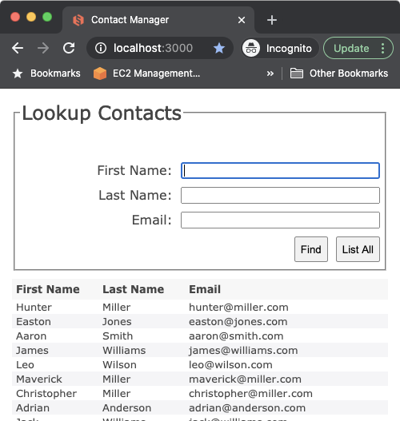
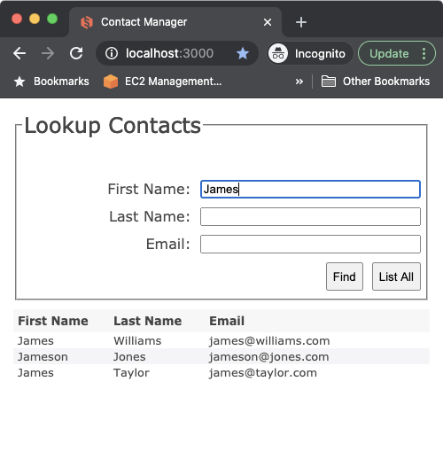
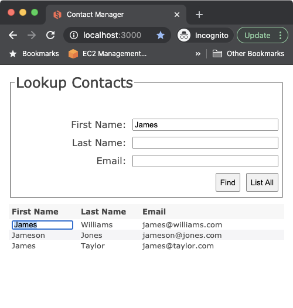

# [](https://github.com/AndyObtiva/glimmer) Glimmer DSL for Opal 0.1.0 (Webify Desktop Apps)
[](http://badge.fury.io/rb/glimmer-dsl-opal)
[](https://gitter.im/AndyObtiva/glimmer?utm_source=badge&utm_medium=badge&utm_campaign=pr-badge&utm_content=badge)

### You can finally live in pure Ruby land even on the web! (no need for HTML/CSS/JS if you do not want to write any)

[Glimmer](https://github.com/AndyObtiva/glimmer) DSL for [Opal](https://opalrb.com/) is an experimental proof-of-concept web GUI adapter for [Glimmer](https://github.com/AndyObtiva/glimmer) desktop apps (i.e. apps built with [Glimmer DSL for SWT](https://github.com/AndyObtiva/glimmer-dsl-swt)). It webifies them via [Rails](https://rubyonrails.org/), allowing Ruby desktop apps to run on the web via [Opal Ruby](https://opalrb.com/) without changing a line of code. Apps may then be custom-styled for the web with standard CSS by web designers. 

Glimmer DSL for Opal webifier successfully reuses the entire [Glimmer](https://github.com/AndyObtiva/glimmer) core DSL engine in [Opal Ruby](https://opalrb.com/) inside a web browser, and as such inherits the full range of powerful Glimmer desktop [data-binding](https://github.com/AndyObtiva/glimmer#data-binding) capabilities for the web.

NOTE: Alpha Version 0.1.0 only supports bare-minimum capabilities for the following [glimmer-dsl-swt](https://github.com/AndyObtiva/glimmer-dsl-swt) [samples](https://github.com/AndyObtiva/glimmer#samples):
- [Hello, World!](#hello-world)
- [Hello, Combo!](#hello-combo)
- [Hello, Computed!](#hello-computed)
- [Hello, List Single Selection!](#hello-list-single-selection)
- [Hello, List Multi Selection!](#hello-list-multi-selection)
- [Hello, Browser!](#hello-browser)
- [Hello, Tab!](#hello-tab)
- [Login](#login)
- [Tic Tac Toe](#tic-tac-toe)
- [Contact Manager](#contact-manager)

Other [Glimmer](https://github.com/AndyObtiva/glimmer) DSL gems:
- [glimmer-dsl-swt](https://github.com/AndyObtiva/glimmer-dsl-swt): Glimmer DSL for SWT (JRuby Desktop Development GUI Library)
- [glimmer-dsl-tk](https://github.com/AndyObtiva/glimmer-dsl-tk): Glimmer DSL for Tk (Ruby Desktop Development GUI Library)
- [glimmer-dsl-xml](https://github.com/AndyObtiva/glimmer-dsl-xml): Glimmer DSL for XML (& HTML)
- [glimmer-dsl-css](https://github.com/AndyObtiva/glimmer-dsl-css): Glimmer DSL for CSS (Cascading Style Sheets)

## Supported Glimmer DSL Keywords

The following keywords from [glimmer-dsl-swt](https://github.com/AndyObtiva/glimmer-dsl-swt) have partial support in Opal:

- `shell`
- `label`
- `combo`
- `button`
- `text`
- `composite`
- `list` & `list(:multi)`
- `tab_folder`
- `tab_item`
- `table`
- `table_column`
- `message_box`
- `on_widget_selected`
- `on_modify_text`
- `observe`
- `bind`
- `async_exec`
- `grid_layout`
- `layout_data`

## Pre-requisites

- Rails 5: [https://github.com/rails/rails/tree/5-2-stable](https://github.com/rails/rails/tree/5-2-stable)
- Opal 1: [https://github.com/opal/opal-rails](https://github.com/opal/opal-rails)
- jQuery 3: [https://code.jquery.com/](https://code.jquery.com/) (jQuery 3.5.1 is included in the glimmer-dsl-opal rubygem)

## Setup

(NOTE: if you run into issues, keep in mind this is a very early experimental and incomplete alpha. Also, there is a slight chance issues you encounter are fixed in master or some other branch that you could check out instead)

Please install a Rails 5 gem (e.g. `gem install rails -v5.2.4.3` )

Start a new Rails 5 app:

```
rails new glimmer_app
```

Add the following to `Gemfile`:

```
gem 'opal-rails', '~> 1.1.2'
gem 'opal-async', '~> 1.1.0'
gem 'opal-jquery', '~> 0.4.4'
gem 'glimmer-dsl-opal', '~> 0.1.0', require: false
gem 'glimmer-dsl-xml', '~> 0.1.0', require: false

```

Follow (opal-rails)[https://github.com/opal/opal-rails] instructions, basically the configuration of: config/initializers/assets.rb

Edit `config/initializers/assets.rb` and add the following at the bottom:
```
Opal.use_gem 'glimmer-dsl-opal'
```

Add the following line to the top of an empty `app/assets/javascripts/application.rb` (replacing `application.js`)

```ruby
require 'glimmer-dsl-opal' # brings opal and other dependencies automatically
```

Add more code to `app/assets/javascripts/application.rb` inside a `Document.ready?` block from one of the samples below or a [Glimmer](https://github.com/AndyObtiva/glimmer) [app](https://github.com/AndyObtiva/glimmer#app)/[custom-shell gem](https://github.com/AndyObtiva/glimmer#custom-shell-gem).

```ruby
Document.ready? do
  # require-statement/code goes here.
end
```

## Samples

Follow the instructions below to try out [glimmer-dsl-swt](https://github.com/AndyObtiva/glimmer-dsl-swt) samples webified via [glimmer-dsl-opal](https://rubygems.org/gems/glimmer-dsl-opal)

Also, this external sample app contains all the samples mentioned below configured inside a Rails 5 [Opal](https://opalrb.com/) app with all the pre-requisites ready to go for convenience:

[https://github.com/AndyObtiva/sample-glimmer-dsl-opal-rails5-app](https://github.com/AndyObtiva/sample-glimmer-dsl-opal-rails5-app)

### Hello Samples

#### Hello, World!

Add the following require statement to `app/assets/javascripts/application.rb`

```ruby
require 'samples/hello/hello_world'
```

Or add the Glimmer code directly if you prefer to play around with it:

```ruby
include Glimmer
   
shell {
  text 'Glimmer'
  label {
    text 'Hello, World!'
  }
}.open
```

Glimmer app on the desktop (using [`glimmer-dsl-swt`](https://github.com/AndyObtiva/glimmer-dsl-swt) gem):


Glimmer app on the web (using `glimmer-dsl-opal` gem):

Start the Rails server:
```
rails s
```

Visit `http://localhost:3000`

You should see "Hello, World!"


#### Hello, Combo!

Add the following require statement to `app/assets/javascripts/application.rb`

```ruby
require 'samples/hello/hello_combo'
```

Or add the Glimmer code directly if you prefer to play around with it:

```ruby
class Person
  attr_accessor :country, :country_options
  
  def initialize
    self.country_options=["", "Canada", "US", "Mexico"]
    self.country = "Canada"
  end

  def reset_country
    self.country = "Canada"
  end
end

class HelloCombo
  include Glimmer
  def launch
    person = Person.new
    shell {
      composite {
        combo(:read_only) {
          selection bind(person, :country)
        }
        button {
          text "Reset"
          on_widget_selected do
            person.reset_country
          end
        }
      }
    }.open
  end
end

HelloCombo.new.launch
```
Glimmer app on the desktop (using [`glimmer-dsl-swt`](https://github.com/AndyObtiva/glimmer-dsl-swt) gem):


Glimmer app on the web (using `glimmer-dsl-opal` gem):

Start the Rails server:
```
rails s
```

Visit `http://localhost:3000`

You should see "Hello, Combo!"



#### Hello, Computed!

Add the following require statement to `app/assets/javascripts/application.rb`


```ruby
require 'samples/hello/hello_computed'
```

Or add the Glimmer code directly if you prefer to play around with it:

```ruby
class HelloComputed
  class Contact
    attr_accessor :first_name, :last_name, :year_of_birth
  
    def initialize(attribute_map)
      @first_name = attribute_map[:first_name]
      @last_name = attribute_map[:last_name]
      @year_of_birth = attribute_map[:year_of_birth]
    end
  
    def name
      "#{last_name}, #{first_name}"
    end
  
    def age
      Time.now.year - year_of_birth.to_i
    rescue
      0
    end
  end
end

class HelloComputed
  include Glimmer

  def initialize
    @contact = Contact.new(
      first_name: 'Barry',
      last_name: 'McKibbin',
      year_of_birth: 1985
    )
  end

  def launch
    shell {
      text 'Hello, Computed!'
      composite {
        grid_layout {
          num_columns 2
          make_columns_equal_width true
          horizontal_spacing 20
          vertical_spacing 10
        }
        label {text 'First &Name: '}
        text {
          text bind(@contact, :first_name)
          layout_data {
            horizontal_alignment :fill
            grab_excess_horizontal_space true
          }
        }
        label {text '&Last Name: '}
        text {
          text bind(@contact, :last_name)
          layout_data {
            horizontal_alignment :fill
            grab_excess_horizontal_space true
          }
        }
        label {text '&Year of Birth: '}
        text {
          text bind(@contact, :year_of_birth)
          layout_data {
            horizontal_alignment :fill
            grab_excess_horizontal_space true
          }
        }
        label {text 'Name: '}
        label {
          text bind(@contact, :name, computed_by: [:first_name, :last_name])
          layout_data {
            horizontal_alignment :fill
            grab_excess_horizontal_space true
          }
        }
        label {text 'Age: '}
        label {
          text bind(@contact, :age, on_write: :to_i, computed_by: [:year_of_birth])
          layout_data {
            horizontal_alignment :fill
            grab_excess_horizontal_space true
          }
        }
      }
    }.open
  end
end

HelloComputed.new.launch
```
Glimmer app on the desktop (using [`glimmer-dsl-swt`](https://github.com/AndyObtiva/glimmer-dsl-swt) gem):


Glimmer app on the web (using `glimmer-dsl-opal` gem):

Start the Rails server:
```
rails s
```

Visit `http://localhost:3000`

You should see "Hello, Computed!"


#### Hello, List Single Selection!

Add the following require statement to `app/assets/javascripts/application.rb`


```ruby
require 'samples/hello/hello_list_single_selection'
```

Or add the Glimmer code directly if you prefer to play around with it:

```ruby
class Person 
  attr_accessor :country, :country_options

  def initialize
    self.country_options=["", "Canada", "US", "Mexico"]
    self.country = "Canada"
  end

  def reset_country
    self.country = "Canada"
  end
end

class HelloListSingleSelection
  include Glimmer
  def launch
    person = Person.new
    shell {
      composite {
        list {
          selection bind(person, :country)
        }
        button {
          text "Reset"
          on_widget_selected do
            person.reset_country
          end
        }
      }
    }.open
  end
end

HelloListSingleSelection.new.launch
```
Glimmer app on the desktop (using [`glimmer-dsl-swt`](https://github.com/AndyObtiva/glimmer-dsl-swt) gem):


Glimmer app on the web (using `glimmer-dsl-opal` gem):

Start the Rails server:
```
rails s
```

Visit `http://localhost:3000`

You should see "Hello, List Single Selection!"



#### Hello, List Multi Selection!

Add the following require statement to `app/assets/javascripts/application.rb`

```ruby
require 'samples/hello/hello_list_multi_selection'
```

Or add the Glimmer code directly if you prefer to play around with it:

```ruby
class Person
  attr_accessor :provinces, :provinces_options

  def initialize
    self.provinces_options=[
      "",
      "Quebec",
      "Ontario",
      "Manitoba",
      "Saskatchewan",
      "Alberta",
      "British Columbia",
      "Nova Skotia",
      "Newfoundland"
    ]
    self.provinces = ["Quebec", "Manitoba", "Alberta"]
  end

  def reset_provinces
    self.provinces = ["Quebec", "Manitoba", "Alberta"]
  end
end

class HelloListMultiSelection
  include Glimmer
  def launch
    person = Person.new
    shell {
      composite {
        list(:multi) {
          selection bind(person, :provinces)
        }
        button {
          text "Reset"
          on_widget_selected do
            person.reset_provinces
          end
        }
      }
    }.open
  end
end

HelloListMultiSelection.new.launch
```
Glimmer app on the desktop (using [`glimmer-dsl-swt`](https://github.com/AndyObtiva/glimmer-dsl-swt) gem):


Glimmer app on the web (using `glimmer-dsl-opal` gem):

Start the Rails server:
```
rails s
```

Visit `http://localhost:3000`

You should see "Hello, List Multi Selection!"



#### Hello, Browser!

Add the following require statement to `app/assets/javascripts/application.rb`

```ruby
require 'samples/hello/hello_browser'
```

Or add the Glimmer code directly if you prefer to play around with it:

```ruby
include Glimmer

shell {
  minimum_size 1024, 860
  browser {
    url 'http://brightonresort.com/about'
  }
}.open
```
Glimmer app on the desktop (using [`glimmer-dsl-swt`](https://github.com/AndyObtiva/glimmer-dsl-swt) gem):


Glimmer app on the web (using `glimmer-dsl-opal` gem):

Start the Rails server:
```
rails s
```

Visit `http://localhost:3000`

You should see "Hello, Browser!"


#### Hello, Tab!

Add the following require statement to `app/assets/javascripts/application.rb`

```ruby
require 'samples/hello/hello_tab'
```

Or add the Glimmer code directly if you prefer to play around with it:

```ruby
class HelloTab
  include Glimmer
  def launch
    shell {
      text "Hello, Tab!"
      tab_folder {
        tab_item {
          text "English"
          label {
            text "Hello, World!"
          }
        }
        tab_item {
          text "French"
          label {
            text "Bonjour, Univers!"
          }
        }
      }
    }.open
  end
end

HelloTab.new.launch
```
Glimmer app on the desktop (using [`glimmer-dsl-swt`](https://github.com/AndyObtiva/glimmer-dsl-swt) gem):


Glimmer app on the web (using `glimmer-dsl-opal` gem):

Start the Rails server:
```
rails s
```

Visit `http://localhost:3000`

You should see "Hello, Tab!"




### Elaborate Samples

#### Login

Add the following require statement to `app/assets/javascripts/application.rb`

```ruby
require 'samples/elaborate/login'
```

Or add the Glimmer code directly if you prefer to play around with it:

```ruby
require "observer"

#Presents login screen data
class LoginPresenter

  attr_accessor :user_name
  attr_accessor :password
  attr_accessor :status

  def initialize
    @user_name = ""
    @password = ""
    @status = "Logged Out"
  end

  def status=(status)
    @status = status

    #TODO add feature to bind dependent properties to master property (2017-07-25 nested data binding)
    notify_observers("logged_in")
    notify_observers("logged_out")
  end

  def logged_in
    self.status == "Logged In"
  end

  def logged_out
    !self.logged_in
  end

  def login
    self.status = "Logged In"
  end

  def logout
    self.user_name = ""
    self.password = ""
    self.status = "Logged Out"
  end

end

#Login screen
class Login
  include Glimmer

  def launch
    presenter = LoginPresenter.new
    @shell = shell {
      text "Login"
      composite {
        grid_layout 2, false #two columns with differing widths

        label { text "Username:" } # goes in column 1
        text {                     # goes in column 2
          text bind(presenter, :user_name)
          enabled bind(presenter, :logged_out)
        }

        label { text "Password:" }
        text(:password, :border) {
          text bind(presenter, :password)
          enabled bind(presenter, :logged_out)
        }

        label { text "Status:" }
        label { text bind(presenter, :status) }

        button {
          text "Login"
          enabled bind(presenter, :logged_out)
          on_widget_selected { presenter.login }
        }

        button {
          text "Logout"
          enabled bind(presenter, :logged_in)
          on_widget_selected { presenter.logout }
        }
      }
    }
    @shell.open
  end
end

Login.new.launch
```
Glimmer app on the desktop (using [`glimmer-dsl-swt`](https://github.com/AndyObtiva/glimmer-dsl-swt) gem):


Glimmer app on the web (using `glimmer-dsl-opal` gem):

Start the Rails server:
```
rails s
```

Visit `http://localhost:3000`

You should see "Login" dialog


#### Tic Tac Toe

Add the following require statement to `app/assets/javascripts/application.rb`

```ruby
require 'samples/elaborate/tic_tac_toe'
```

Or add the Glimmer code directly if you prefer to play around with it:

```ruby
class TicTacToe
  class Cell
    EMPTY = ""
    attr_accessor :sign, :empty
  
    def initialize
      reset
    end
  
    def mark(sign)
      self.sign = sign
    end
  
    def reset
      self.sign = EMPTY
    end
  
    def sign=(sign_symbol)
      @sign = sign_symbol
      self.empty = sign == EMPTY
    end
  
    def marked
      !empty
    end
  end
end

class TicTacToe
  class Board
    DRAW = :draw
    IN_PROGRESS = :in_progress
    WIN = :win
    attr :winning_sign
    attr_accessor :game_status
  
    def initialize
      @sign_state_machine = {nil => "X", "X" => "O", "O" => "X"}
      build_grid
      @winning_sign = Cell::EMPTY
      @game_status = IN_PROGRESS
    end
  
    #row and column numbers are 1-based
    def mark(row, column)
      self[row, column].mark(current_sign)
      game_over? #updates winning sign
    end
  
    def current_sign
      @current_sign = @sign_state_machine[@current_sign]
    end
  
    def [](row, column)
      @grid[row-1][column-1]
    end
  
    def game_over?
       win? or draw?
    end
  
    def win?
      win = (row_win? or column_win? or diagonal_win?)
      self.game_status=WIN if win
      win
    end
  
    def reset
      (1..3).each do |row|
        (1..3).each do |column|
          self[row, column].reset
        end
      end
      @winning_sign = Cell::EMPTY
      @current_sign = nil
      self.game_status=IN_PROGRESS
    end
  
    private
  
    def build_grid
      @grid = []
      3.times do |row_index| #0-based
        @grid << []
        3.times { @grid[row_index] << Cell.new }
      end
    end
  
    def row_win?
      (1..3).each do |row|
        if row_has_same_sign(row)
          @winning_sign = self[row, 1].sign
          return true
        end
      end
      false
    end
  
    def column_win?
      (1..3).each do |column|
        if column_has_same_sign(column)
          @winning_sign = self[1, column].sign
          return true
        end
      end
      false
    end
  
    #needs refactoring if we ever decide to make the board size dynamic
    def diagonal_win?
      if (self[1, 1].sign == self[2, 2].sign) and (self[2, 2].sign == self[3, 3].sign) and self[1, 1].marked
        @winning_sign = self[1, 1].sign
        return true
      end
      if (self[3, 1].sign == self[2, 2].sign) and (self[2, 2].sign == self[1, 3].sign) and self[3, 1].marked
        @winning_sign = self[3, 1].sign
        return true
      end
      false
    end
  
    def draw?
      @board_full = true
      3.times do |x|
        3.times do |y|
          @board_full = false if self[x, y].empty
        end
      end
      self.game_status = DRAW if @board_full
      @board_full
    end
  
    def row_has_same_sign(number)
      row_sign = self[number, 1].sign
      [2, 3].each do |column|
        return false unless row_sign == (self[number, column].sign)
      end
      true if self[number, 1].marked
    end
  
    def column_has_same_sign(number)
      column_sign = self[1, number].sign
      [2, 3].each do |row|
        return false unless column_sign == (self[row, number].sign)
      end
      true if self[1, number].marked
    end
  
  end
end

class TicTacToe
  include Glimmer

  def initialize
    @tic_tac_toe_board = Board.new
    @shell = shell {
      text "Tic-Tac-Toe"
      composite {
        grid_layout 3, true
        (1..3).each { |row|
          (1..3).each { |column|
            button {
              layout_data :fill, :fill, true, true
              text        bind(@tic_tac_toe_board[row, column], :sign)
              enabled     bind(@tic_tac_toe_board[row, column], :empty)
              on_widget_selected {
                @tic_tac_toe_board.mark(row, column)
              }
            }
          }
        }
      }
    }
    observe(@tic_tac_toe_board, :game_status) { |game_status|
      display_win_message if game_status == Board::WIN
      display_draw_message if game_status == Board::DRAW
    }
  end

  def display_win_message
    display_game_over_message("Player #{@tic_tac_toe_board.winning_sign} has won!")
  end

  def display_draw_message
    display_game_over_message("Draw!")
  end

  def display_game_over_message(message_text)
    message_box(@shell) {
      text 'Game Over'
      message message_text
    }.open
    @tic_tac_toe_board.reset
  end

  def open
    @shell.open
  end
end

TicTacToe.new.open
```
Glimmer app on the desktop (using [`glimmer-dsl-swt`](https://github.com/AndyObtiva/glimmer-dsl-swt) gem):


Glimmer app on the web (using `glimmer-dsl-opal` gem):

Start the Rails server:
```
rails s
```

Visit `http://localhost:3000`

You should see "Tic Tac Toe"





#### Contact Manager

Add the following require statement to `app/assets/javascripts/application.rb`

```ruby
require 'samples/elaborate/contact_manager'
```

Or add the Glimmer code directly if you prefer to play around with it:

```ruby
class ContactManager
  class Contact
    attr_accessor :first_name, :last_name, :email
  
    def initialize(attribute_map)
      @first_name = attribute_map[:first_name]
      @last_name = attribute_map[:last_name]
      @email = attribute_map[:email]
    end
  end
end

class ContactManager
  class ContactRepository
    NAMES_FIRST = %w[
      Liam
      Noah
      William
      James
      Oliver
      Benjamin
      Elijah
      Lucas
      Mason
      Logan
      Alexander
      Ethan
      Jacob
      Michael
      Daniel
      Henry
      Jackson
      Sebastian
      Aiden
      Matthew
      Samuel
      David
      Joseph
      Carter
      Owen
      Wyatt
      John
      Jack
      Luke
      Jayden
      Dylan
      Grayson
      Levi
      Isaac
      Gabriel
      Julian
      Mateo
      Anthony
      Jaxon
      Lincoln
      Joshua
      Christopher
      Andrew
      Theodore
      Caleb
      Ryan
      Asher
      Nathan
      Thomas
      Leo
      Isaiah
      Charles
      Josiah
      Hudson
      Christian
      Hunter
      Connor
      Eli
      Ezra
      Aaron
      Landon
      Adrian
      Jonathan
      Nolan
      Jeremiah
      Easton
      Elias
      Colton
      Cameron
      Carson
      Robert
      Angel
      Maverick
      Nicholas
      Dominic
      Jaxson
      Greyson
      Adam
      Ian
      Austin
      Santiago
      Jordan
      Cooper
      Brayden
      Roman
      Evan
      Ezekiel
      Xaviar
      Jose
      Jace
      Jameson
      Leonardo
      Axel
      Everett
      Kayden
      Miles
      Sawyer
      Jason
      Emma
      Olivia
      Ava
      Isabella
      Sophia
      Charlotte
      Mia
      Amelia
      Harper
      Evelyn
      Abigail
      Emily
      Elizabeth
      Mila
      Ella
      Avery
      Sofia
      Camila
      Aria
      Scarlett
      Victoria
      Madison
      Luna
      Grace
      Chloe
      Penelope
      Layla
      Riley
      Zoey
      Nora
      Lily
      Eleanor
      Hannah
      Lillian
      Addison
      Aubrey
      Ellie
      Stella
      Natalie
      Zoe
      Leah
      Hazel
      Violet
      Aurora
      Savannah
      Audrey
      Brooklyn
      Bella
      Claire
      Skylar
      Lucy
      Paisley
      Everly
      Anna
      Caroline
      Nova
      Genesis
      Emilia
      Kennedy
      Samantha
      Maya
      Willow
      Kinsley
      Naomi
      Aaliyah
      Elena
      Sarah
      Ariana
      Allison
      Gabriella
      Alice
      Madelyn
      Cora
      Ruby
      Eva
      Serenity
      Autumn
      Adeline
      Hailey
      Gianna
      Valentina
      Isla
      Eliana
      Quinn
      Nevaeh
      Ivy
      Sadie
      Piper
      Lydia
      Alexa
      Josephine
      Emery
      Julia
      Delilah
      Arianna
      Vivian
      Kaylee
      Sophie
      Brielle
      Madeline
    ]
    NAMES_LAST = %w[
      Smith
      Johnson
      Williams
      Brown
      Jones
      Miller
      Davis
      Wilson
      Anderson
      Taylor
    ]
    def initialize(contacts = nil)
      @contacts = contacts || 1000.times.map do |n|
        random_first_name_index = (rand*NAMES_FIRST.size).to_i
        random_last_name_index = (rand*NAMES_LAST.size).to_i
        first_name = NAMES_FIRST[random_first_name_index]
        last_name = NAMES_LAST[random_last_name_index]
        email = "#{first_name}@#{last_name}.com".downcase
        Contact.new(
          first_name: first_name,
          last_name: last_name,
          email: email
        )
      end
    end
  
    def find(attribute_filter_map)
      @contacts.find_all do |contact|
        match = true
        attribute_filter_map.keys.each do |attribute_name|
          contact_value = contact.send(attribute_name).downcase
          filter_value = attribute_filter_map[attribute_name].downcase
          match = false unless contact_value.match(filter_value)
        end
        match
      end
    end
  end
end

class ContactManager
  class ContactManagerPresenter
    attr_accessor :results
    @@contact_attributes = [:first_name, :last_name, :email]
    @@contact_attributes.each {|attribute_name| attr_accessor attribute_name}
  
    def initialize(contact_repository = nil)
      @contact_repository = contact_repository || ContactRepository.new
      @results = []
    end
  
    def list
      self.results = @contact_repository.find({})
    end
  
    def find
      filter_map = {}
      @@contact_attributes.each do |attribute_name|
        filter_map[attribute_name] = self.send(attribute_name) if self.send(attribute_name)
      end
      self.results = @contact_repository.find(filter_map)
      @sort_attribute_name = nil
      @sort_direction_ascending = nil
    end
  
    def toggle_sort(attribute_name)
      @sort_attribute_name = attribute_name
      @sort_direction_ascending = !@sort_direction_ascending
      sorted_results = self.results.sort_by {|contact| contact.send(attribute_name).downcase}
      sorted_results = sorted_results.reverse unless @sort_direction_ascending
      self.results = sorted_results
    end
  end
end

class ContactManager
  include Glimmer

  def initialize
    @contact_manager_presenter = ContactManagerPresenter.new
    @contact_manager_presenter.list
  end

  def launch
    shell {
      text "Contact Manager"
      composite {
        composite {
          grid_layout 2, false
          label {text "First &Name: "}
          text {
            text bind(@contact_manager_presenter, :first_name)
            on_key_pressed {|key_event|
              @contact_manager_presenter.find if key_event.keyCode == Glimmer::SWT::SWTProxy[:cr]
            }
          }
          label {text "&Last Name: "}
          text {
            text bind(@contact_manager_presenter, :last_name)
            on_key_pressed {|key_event|
              @contact_manager_presenter.find if key_event.keyCode == Glimmer::SWT::SWTProxy[:cr]
            }
          }
          label {text "&Email: "}
          text {
            text bind(@contact_manager_presenter, :email)
            on_key_pressed {|key_event|
              @contact_manager_presenter.find if key_event.keyCode == Glimmer::SWT::SWTProxy[:cr]
            }
          }
          composite {
            grid_layout 2, false
            button {
              text "&Find"
              on_widget_selected {
                @contact_manager_presenter.find
              }
            }
            button {
              text "&List All"
              on_widget_selected {
                @contact_manager_presenter.list
              }
            }
          }
        }

        table(:multi) { |table_proxy|
          layout_data {
            horizontal_alignment :fill
            vertical_alignment :fill
            grab_excess_horizontal_space true
            grab_excess_vertical_space true
            height_hint 200
          }
          table_column {
            text "First Name"
            width 80
            on_widget_selected {
              @contact_manager_presenter.toggle_sort(:first_name)
            }
          }
          table_column {
            text "Last Name"
            width 80
            on_widget_selected {
              @contact_manager_presenter.toggle_sort(:last_name)
            }
          }
          table_column {
            text "Email"
            width 200
            on_widget_selected {
              @contact_manager_presenter.toggle_sort(:email)
            }
          }
          items bind(@contact_manager_presenter, :results), column_properties(:first_name, :last_name, :email)
          on_mouse_down { |event|
            table_proxy.edit_table_item(event.table_item, event.column_index)
          }
        }
      }
    }.open
  end
end

ContactManager.new.launch

```
Glimmer app on the desktop (using [`glimmer-dsl-swt`](https://github.com/AndyObtiva/glimmer-dsl-swt) gem):

Glimmer DSL for SWT Contact Manager


Glimmer DSL for SWT Contact Manager Find


Glimmer DSL for SWT Contact Manager Edit Started


Glimmer DSL for SWT Contact Manager Edit In Progress


Glimmer DSL for SWT Contact Manager Edit Done


Glimmer app on the web (using `glimmer-dsl-opal` gem):

Start the Rails server:
```
rails s
```

Visit `http://localhost:3000`

You should see "Tic Tac Toe"

Glimmer DSL for Opal Contact Manager



Glimmer DSL for Opal Contact Manager Find



Glimmer DSL for Opal Contact Manager Edit Started



Glimmer DSL for Opal Contact Manager Edit In Progress


Glimmer DSL for Opal Contact Manager Edit Done


## Help

### Issues

You may submit [issues](https://github.com/AndyObtiva/glimmer/issues) on [GitHub](https://github.com/AndyObtiva/glimmer/issues).

[Click here to submit an issue.](https://github.com/AndyObtiva/glimmer/issues)

### Chat

If you need live help, try to [](https://gitter.im/AndyObtiva/glimmer?utm_source=badge&utm_medium=badge&utm_campaign=pr-badge&utm_content=badge)

## Feature Suggestions

These features have been suggested. You might see them in a future version of Glimmer. You are welcome to contribute more feature suggestions.

[TODO.md](TODO.md)

## Change Log

[CHANGELOG.md](CHANGELOG.md)

## Contributing

[CONTRIBUTING.md](CONTRIBUTING.md)

## Contributors

* [Andy Maleh](https://github.com/AndyObtiva) (Founder)

[Click here to view contributor commits.](https://github.com/AndyObtiva/glimmer-dsl-opal/graphs/contributors)

## License

[MIT](https://opensource.org/licenses/MIT)

Copyright (c) 2020 - Andy Maleh. 
See [LICENSE.txt](LICENSE.txt) for further details.

--

[](https://github.com/AndyObtiva/glimmer) Built for [Glimmer](https://github.com/AndyObtiva/glimmer) (Ruby Desktop Development GUI Library).
